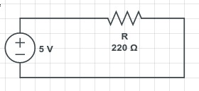
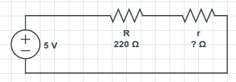
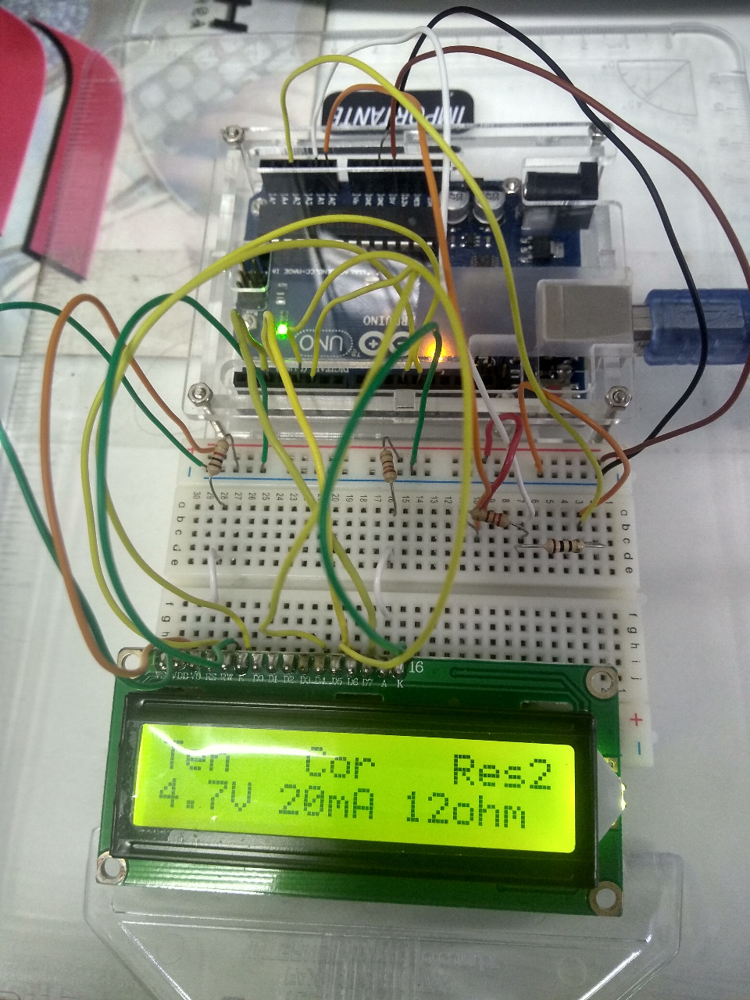
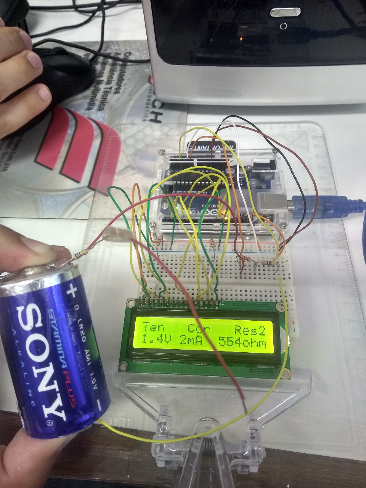
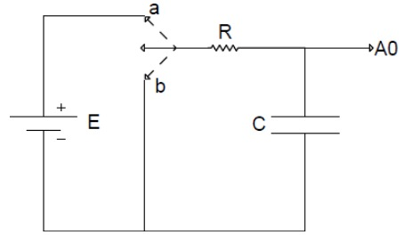
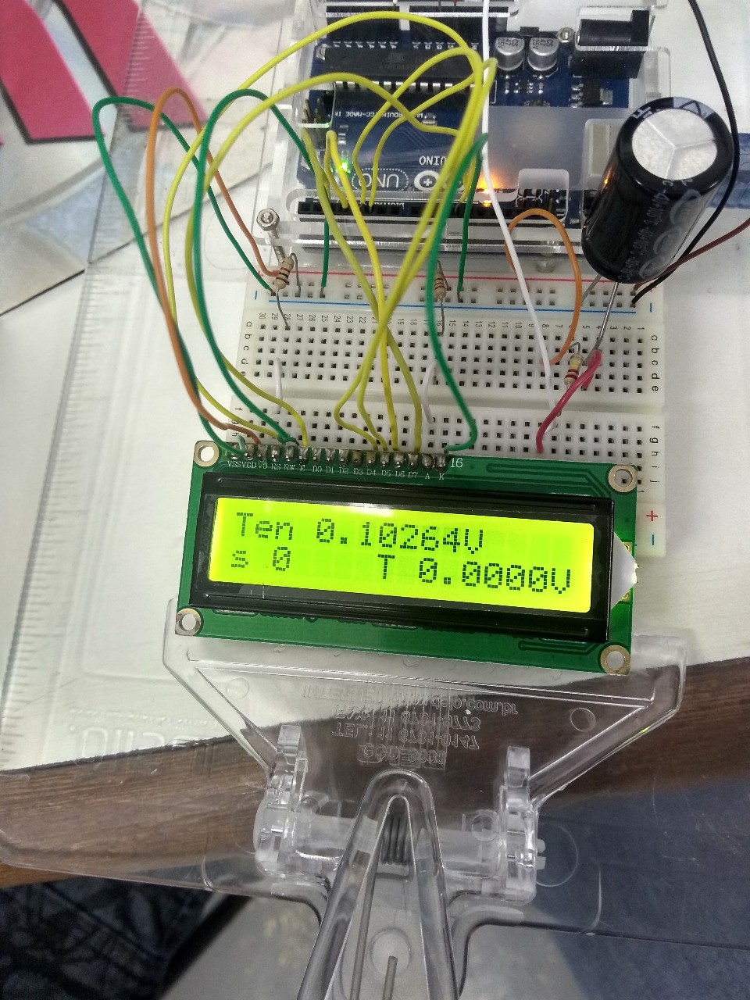

Primeiramente, como interface comum entre todos os experimentos, montamos a placa Arduino junto a uma protoboard e a um display LCD 2x16.

## Medida de Corrente (aquecimento)

Num primeiro momento, montamos um simples circuito com uma resistência de 220 volts e uma fonte eletromotriz de 5V (Arduino). Como experimento, usamos a lei de Ohm $V = Ri$ para calcular a corrente no circuito e mostrá-la no display. Para tal, definimos $R = 220$, mas fizemos as medidas de diferença de tensão $\Delta V = V_1 - V_0$ explicitamente com o Arduino. Assim, nosso programa recebeu como entrada 2 valores $V_1, V_0$ e calculou a corrente no sistema. Como esperado, uma corrente próxima a $0.02 A$ foi obtida. 

### Esquema

O esquema do circuito adotado pode ser visto na figura \ref{fig:simple}.

```{r simple, echo=FALSE, fig.cap="Circuito com R = 220 ohm", out.width = "30%"}

```

### Código utilizado

```{Rcpp eval=FALSE}
#include <LiquidCrystal.h>
using namespace std;

const int rs = 12, en = 11, d4 = 5, d5 = 4, d6 = 3, d7 = 2;
LiquidCrystal lcd(rs, en, d4, d5, d6, d7);
const float V = 5.0, R = 220.0;

void setup() {
 lcd.begin(16, 2);
}

void loop(){
  lcd.clear();
  lcd.print("A0   A1   Cor");
  
  float a0 = analogRead(A0) / (1023.0 / 5.0);
  float a1 = analogRead(A1) / (1023.0 / 5.0);
  float amp = abs(a1 - a0) / R;
  lcd.setCursor(0, 1);
  lcd.print(String(a0, 1) + "V");
  lcd.setCursor(5, 1);
  lcd.print(String(a1, 1) + "V");
  lcd.setCursor(10, 1);
  lcd.print(String(amp, 3) + "A");
  
  delay(100);
}
```

## Medida de corrente e de resistência desconhecida

Em sequência, uma novo resistor com valor de resistência desconhecido ($r$) foi adicionado ao circuito, como mostrado no esquema abaixo. A nova tarefa, então, foi descobrir a resistência desse novo componente, novamente utilizando a lei de Ohm, mas agora sabendo que, como os resistores estão em série, a corrente é constante. Podemos então utilizar $V_1 - V_0 = Ri$ e $V_3 - V_1 = ri$ e então encontrar $r$. Além disso, uma bateria de $1.5\ V$ foi utilizada como fonte eletromotriz para nos certificarmos de que a resistência inferida continuaria a mesma. Foram testados também valores diferentes para a resistência $r$. As variações na resistência e na voltagem podem ser vistas nas imagens \ref{fig:sembat} e \ref{fig:combat}.

### Esquema

O esquema do circuito adotado pode ser visto na figura \ref{fig:unk}.

```{r unk, echo=FALSE, fig.cap="Circuito com R = 220 ohm e r desconhecido", out.width = "30%"}

```

### Código utilizado

```{Rcpp eval=FALSE}
#include <LiquidCrystal.h>
using namespace std;

const int rs = 12, en = 11, d4 = 5, d5 = 4, d6 = 3, d7 = 2;
LiquidCrystal lcd(rs, en, d4, d5, d6, d7);
const float R = 220.0;

void setup() {
 lcd.begin(16, 2);
}

float roundTo(float x, int places) {
  for(int i = 0; i < places; i++) x *= 10;
  float y = (int)round(x);
  for(int i = 0; i < places; i++) y /= 10;
  return y;
}

String getString(float x, int places = 0) {
  if(places == 0)
    return String((int)roundTo(x, 0));
  return String(roundTo(x, places), places);
}

void loop(){
  lcd.clear();
  lcd.print("Ten   Cor   Res2");
  
  float a0 = analogRead(A0) / (1023.0 / 5.0);
  float a1 = analogRead(A1) / (1023.0 / 5.0);
  float amp = (a1 - a0) / R;
  
  float a3 = analogRead(A3) / (1023.0 / 5.0);
  float R2 = (a3 - a1) / amp;
  
  lcd.setCursor(0, 1);
  lcd.print(getString(a0, 1) + "V");
  lcd.setCursor(5, 1);
  lcd.print(getString(abs(amp * 1000)) + "mA");
  lcd.setCursor(10, 1);
  lcd.print(getString(R2) + "ohm");
  
  delay(100);
}
```

## Fotos

As fotos dos experimentos podem ser vistas nas imagens \ref{fig:sembat} e \ref{fig:combat}.

```{r sembat, echo=FALSE, fig.cap="Com fonte eletromotriz do Arduino", out.width = "30%"}

```

```{r combat, echo=FALSE, fig.cap="Com bateria de 1.5 V", out.width = "30%"}

```

## Circuito RC

Num último momento, montamos um circuito RC como o mostrado abaixo e acompanhamos o processo de carga e de descarga do capacitor por cerca de 20 minutos, anotando a diferenção de tensão no sistema a cada 20 segundos a fim de analisar a curva formada. Utilizamos novamente uma fonte eletromotriz de $5V$ e um capacitor com capacitância de $2200\mu F$. Além do citado acima, foi possível descobrir a resistência desconhecida presente no circuito.

### Esquema

O esquema do circuito adotado pode ser visto na figura \ref{fig:cap}.

```{r cap, echo=FALSE, fig.cap="Circuito RC", out.width = "30%"}

```

## Fotos

O experimento pode ser visualizado na imagem \ref{fig:capfoto}.

```{r capfoto, echo=FALSE, fig.cap="Com fonte eletromotriz do Arduino", out.width = "30%"}

```

## Gráfico

Podemos observar a proximidade das curvas desenhadas aos gráficos das funções
$\epsilon (1 - e^{-t/{rc}})$ (carga) e $\epsilon \times e^{-t/{rc}}$ (descarga). Quando a função de carga alcança aproximadamente $(1-e^{-1}) \times \epsilon$ sabemos que $T = RC$. Notamos que tal $T \approx 515\ s$, portanto $R \approx 234\ k\Omega$ . O gráfico das funções anteriores pode ser visto na imagem a seguir.

```{r carga_descarga, fig.caption="aa", fig.width=7, fig.height=5, echo=FALSE}
dados.capacitor = read.csv("carga.csv")
x = dados.capacitor[,1] #seq(0.0, 4, length.out=180)
y.carga = dados.capacitor[,2]
y.descarga = dados.capacitor[,3]

grid.arrange(
  top="Tensão x Tempo",
  ggplot(mapping=aes(x=x, y=y.carga))
    + geom_line(aes(colour="Carga"))
    + geom_line(aes(x=x, y=y.descarga, colour="Descarga"))
    + ylab(TeX(paste("Tensão", parens(ph.TeX.tensao))))
    + xlab(TeX(paste("Tempo", parens(ph.TeX.tempo))))
    + xlim(c(0.0, 1280.0))
    + ylim(c(0.0, 5.0))
    + scale_colour_manual("", values=c("Carga"="black", "Descarga"="red"))
  )
```
