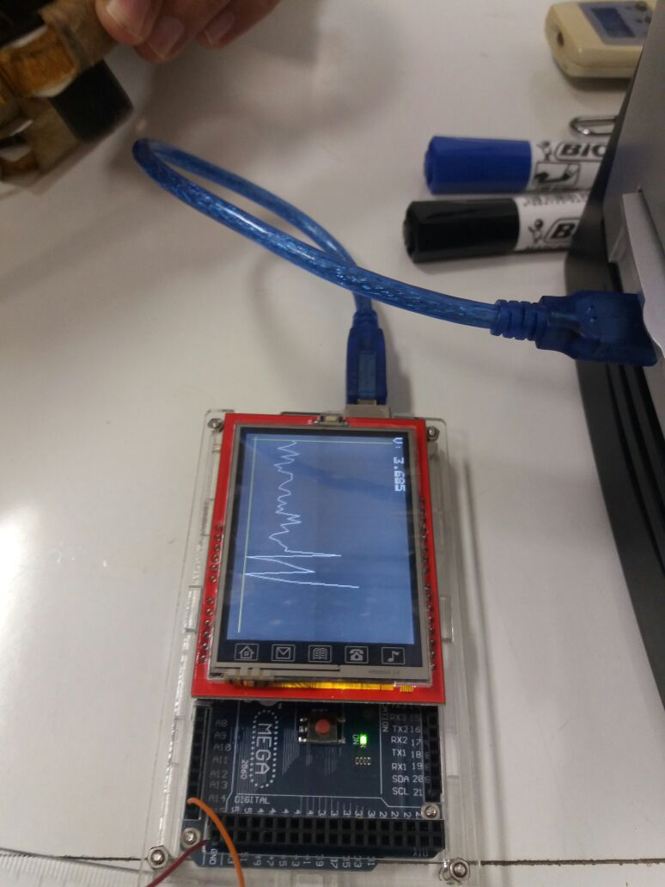
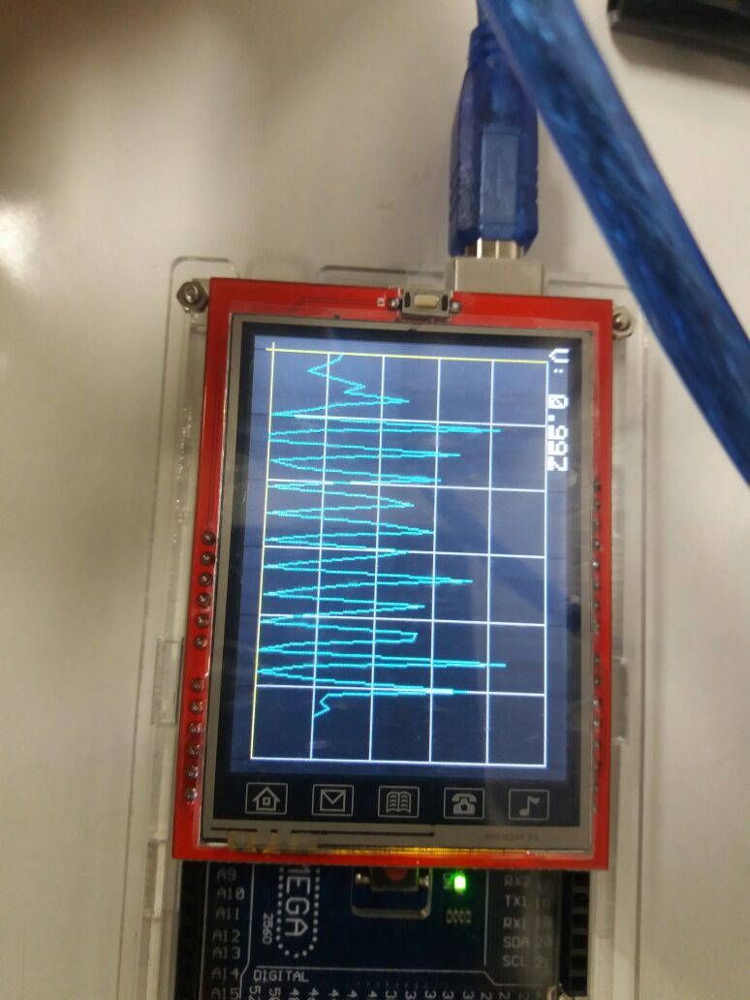
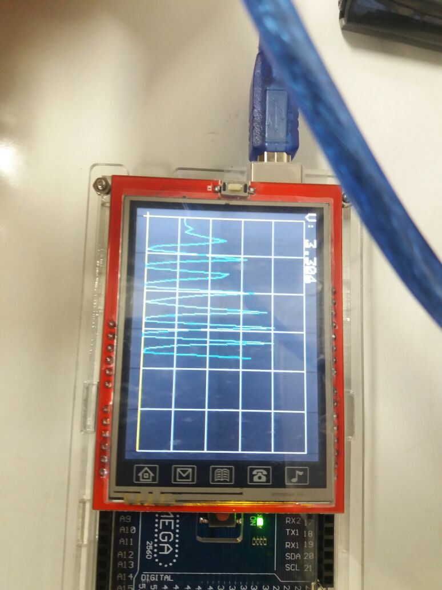
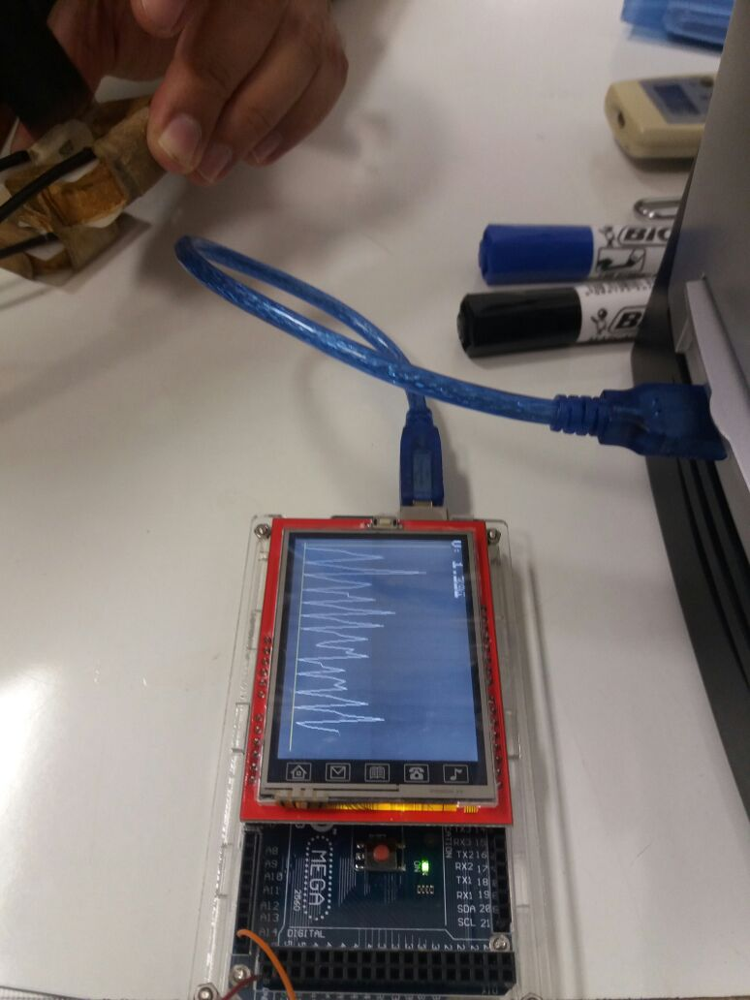
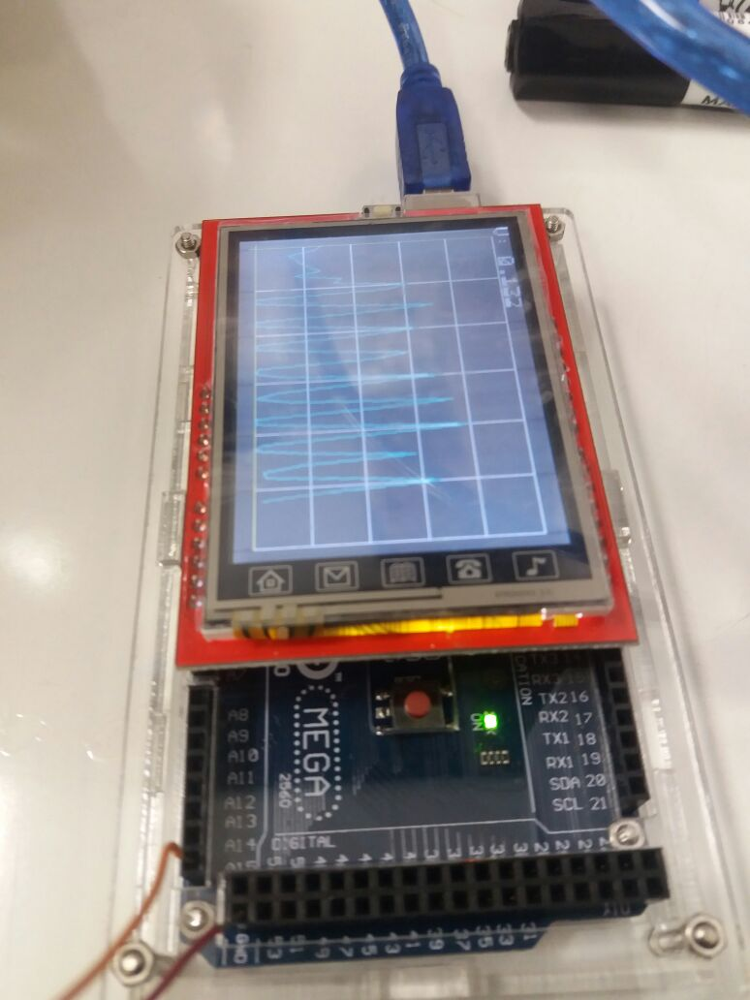
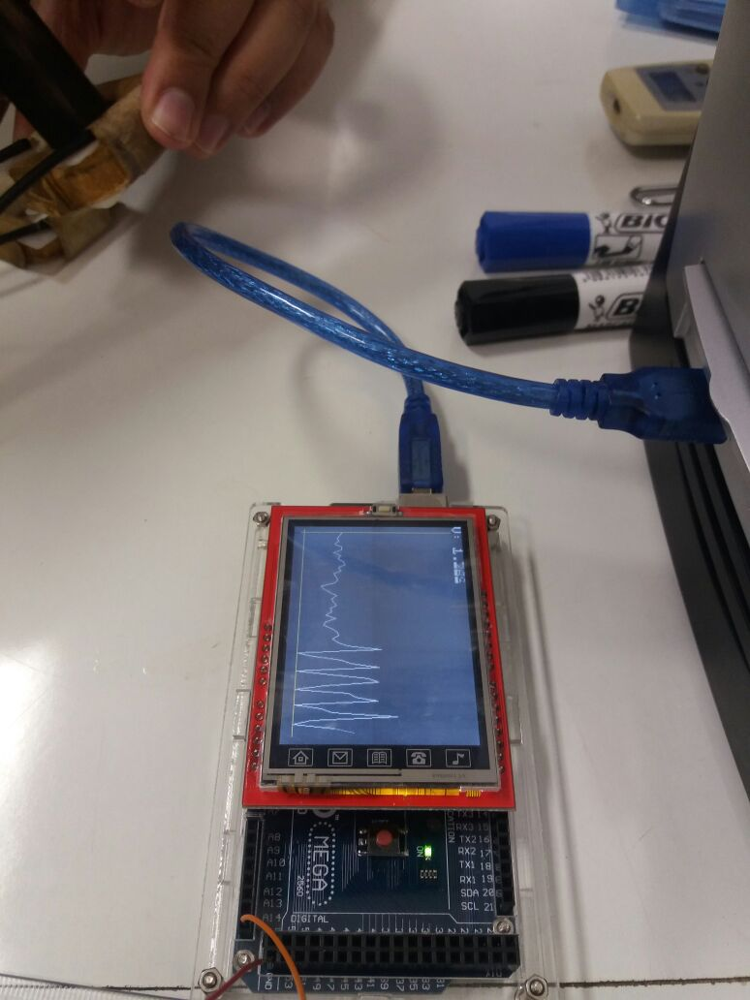

## Medidas com o Arduino Mega

```{r img_01, echo=FALSE, fig.cap="Imagem 1", out.width = "30%"}

```

```{r img_02, echo=FALSE, fig.cap="Imagem 2", out.width = "30%"}

```

```{r img_03, echo=FALSE, fig.cap="Imagem 3", out.width = "30%"}

```

```{r img_04, echo=FALSE, fig.cap="Imagem 4", out.width = "30%"}

```

```{r img_05, echo=FALSE, fig.cap="Imagem 5", out.width = "30%"}

```

```{r img_06, echo=FALSE, fig.cap="Imagem 6", out.width = "30%"}

```
