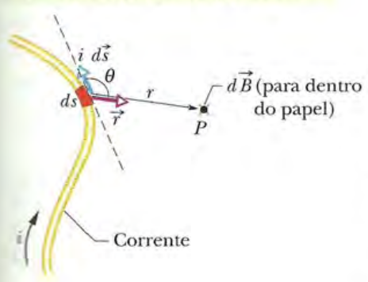
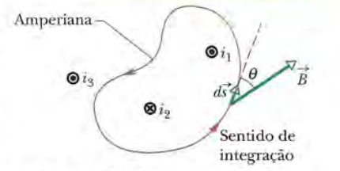

Antes de adentrar os resultados obtidos através das montagens realizadas, é necessário abordar alguns aspectos teóricos a respeito das ideias utilizadas.

## Corrente e Campo Magnético

```{r campo-corrente, echo=FALSE, fig.cap="Uma seção $i \\vec{ds}$ do fio produz um elemento de campo magnético $\\vec{dB}$ no ponto P. Neste exemplo, o sentido da corrente é para dentro do papel.", out.width = "30%"}

```

Partimos do conceito de que uma corrente elétrica (partículas elétricas em movimento) produzem campos magnéticos. Como visto na figura \ref{fig:campo-corrente}, considerando que a corrente percorra um fio de formato arbitrário, o caĺculo do campo magnético produzido em um ponto P ($dB$) depende de fatores como o sentido da corrente elétrica no fio ($i$), a distância do fio até o ponto desejado ($r$) e o ângulo formado entre o sentido da corrente e o ponto $P$ ($\theta$). É necessário observar que o caĺculo não é feito a partir do fio como um todo, mas sim a partir da divisão (mental) do fio em partes infinitesimais $ds$, onde cada uma dessas partes influencia o campo magnético de acordo com os fatores dados anteriormente. As seções $ds$ são definidas por vetores $\vec{ds}$, de módulo $ds$ e com a mesma direção da corrente naquela seção. A partir disso, pode-se calcular $\vec{dB}$ através da **lei de Biot-Savart**, onde $\mu_{0}$ é uma
constante conhecida como permeabilidade do vácuo: $\vec{dB} = \frac{\mu_{0}\ i\ \vec{ds} \times \vec{r}}{4\pi r^2}$. O campo magnético total ($B$) é obtido a partir da soma dos campos de cada seção do fio ($\sum\vec{dB}$).

Quando a distribuição das correntes se torna muito complicada, isto é, varia ao longo de uma geometria pouco convencional, utilizar a lei de Biot-Savart pode ser uma tarefa difícil. Nesses casos, podemos usar a **lei de Ampère** para facilitar este cálculo: $\oint \vec{B} \cdot \vec{ds} = \mu_{0}i_{env}$. Para proceder com este cálculo, envolvemos a corrente total $i_{env}$ em uma curva fechada de nome _amperiana_, como visto na figura \ref{fig:amperiana}.


```{r amperiana, echo=FALSE, fig.cap="Uma amperiana que envolve dois fios retilíneos e exclui um terceiro.", out.width = "30%"}

```

Assim como no caso da figura \ref{fig:campo-corrente}, secionamos a amperiana em regiões $\vec{ds}$ tangentes à curva e apontando no sentido da integração. Para resolver a integral da lei de Ampére, não é necessário conhecer o sentido de $\vec{B}$ em todas as regiões da amperiana, bastando atribuir um sentido arbitrário e que coincida com o sentido de integração. Utilizando a regra da mão direita, podemos definir o sentido das correntes que atravessam a amperiana e, assim, obter o $i_{env}$ ($i_{1} - i_{2}$ na figura \ref{fig:amperiana}). Vale ressaltar que nos casos como o da figura \ref{fig:amperiana} podemos desconsiderar a influência da corrente $i_{3}$ no campo magnético da amperiana pois a integral calculada é de uma curva fechada.

## Indução e Indutância
