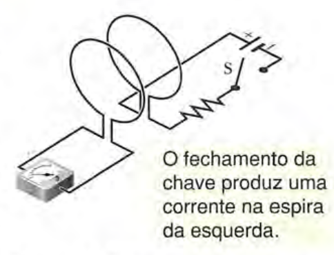

Antes de adentrar os resultados obtidos através das montagens realizadas, é necessário abordar alguns aspectos teóricos a respeito das ideias utilizadas. As imagens utilizadas foram retiradas do livro "Halliday e Resnick - Fundamentos de Física - Eletromagnetismo. Vol. 3, $9^a$ Ed."

## Correntes elétricas produzindo campos magnéticos

```{r campo-corrente, echo=FALSE, fig.cap="Uma seção $i \\vec{ds}$ do fio produz um elemento de campo magnético $\\vec{dB}$ no ponto P. Neste exemplo, o sentido da corrente é para dentro do papel.", out.width = "30%"}
knitr::include_graphics("imgs/campo-corrente.png")
```

Partimos do conceito de que uma corrente elétrica (partículas elétricas em movimento) produzem campos magnéticos. Como visto na figura \ref{fig:campo-corrente}, considerando que a corrente percorra um fio de formato arbitrário, o caĺculo do campo magnético produzido em um ponto P ($dB$) depende de fatores como o sentido da corrente elétrica no fio ($i$), a distância do fio até o ponto desejado ($r$) e o ângulo formado entre o sentido da corrente e o ponto $P$ ($\theta$). É necessário observar que o caĺculo não é feito a partir do fio como um todo, mas sim a partir da divisão (mental) do fio em partes infinitesimais $ds$, onde cada uma dessas partes influencia o campo magnético de acordo com os fatores dados anteriormente. As seções $ds$ são definidas por vetores $\vec{ds}$, de módulo $ds$ e com a mesma direção da corrente naquela seção. A partir disso, pode-se calcular $\vec{dB}$ através da **lei de Biot-Savart**, onde $\mu_{0}$ é uma
constante conhecida como permeabilidade do vácuo: $\vec{dB} = \frac{\mu_{0}\ i\ \vec{ds} \times \vec{r}}{4\pi r^2}$. O campo magnético total ($B$) é obtido a partir da soma dos campos de cada seção do fio ($\sum\vec{dB}$).

Quando a distribuição das correntes se torna muito complicada, isto é, varia ao longo de uma geometria pouco convencional, utilizar a lei de Biot-Savart pode ser uma tarefa difícil. Nesses casos, podemos usar a **lei de Ampère** para facilitar este cálculo: $\oint \vec{B} \cdot \vec{ds} = \mu_{0}i_{env}$. Para proceder com este cálculo, envolvemos a corrente total $i_{env}$ em uma curva fechada de nome _amperiana_, como visto na figura \ref{fig:amperiana}.


```{r amperiana, echo=FALSE, fig.cap="Uma amperiana que envolve dois fios retilíneos e exclui um terceiro.", out.width = "30%"}

```

Assim como no caso da figura \ref{fig:campo-corrente}, secionamos a amperiana em regiões $\vec{ds}$ tangentes à curva e apontando no sentido da integração. Para resolver a integral da lei de Ampére, não é necessário conhecer o sentido de $\vec{B}$ em todas as regiões da amperiana, bastando atribuir um sentido arbitrário e que coincida com o sentido de integração. Utilizando a regra da mão direita, podemos definir o sentido das correntes que atravessam a amperiana e, assim, obter o $i_{env}$ ($i_{1} - i_{2}$ na figura \ref{fig:amperiana}). Vale ressaltar que nos casos como o da figura \ref{fig:amperiana} podemos desconsiderar a influência da corrente $i_{3}$ no campo magnético da amperiana pois a integral calculada é de uma curva fechada.

## Campos magnéticos induzindo correntes elétricas

A relação entre campos magnéticos e correntes elétricas se extende além do relatado na seção anterior. É possível produzir uma corrente elétrica a partir de um campo magnético, através de um processo conhecido como **indução**. A corrente gerada por indução é chamada de **corrente induzida** e o trabalho realizado por unidade de carga para gerar essa corrente é chamado de **força eletromotriz induzida**.

```{r exp1, echo=FALSE, fig.cap="Quando o imã se movimenta dentro da área da espira é possível detectar o aparecimento de uma corrente.", out.width = "30%"}

```

Podemos observar na figura \ref{fig:exp1} uma forma de visualizar o aparecimento dessa **corrente induzida**: movimentando um ímã em forma de barra dentro da área de uma espira ligada a um amperímetro. Este efeito observado traz algumas características consigo:

1. A corrente induzida só existe enquanto dura o movimento do ímã.
2. O valor da corrente gerada é diretamente proporcional à quantidade de movimento.
3. Ao iniciar o movimento aproximando o polo norte do ímã a corrente tem sentido horário e sentido anti-horário quando o ímã é afastado. Quando o movimento é iniciado aproximando o polo sul do ímã a corrente tem sentido anti-horário e sentido horário quando o ímã é afastado.

A característica mencionada no item 3 pode ser generalizada através da **lei de Lenz**, que demonstra que a corrente induzida na espira tem um sentido tal que o campo magnético produzido pela corrente induzida é oposto ao campo magnético que induz a corrente.

Outra maneira de visualizar o aparecimento de uma corrente através de indução é mostrada na figura \ref{fig:exp2}. Neste exemplo temos duas espiras condutoras de eletricidade bem próximas mas que não se tocam. Quando há **variação** na corrente do circuito mais à direita (abrindo ou fechando a chave S) é possível observar o aparecimento de uma corrente na espira mais à esquerda. 

```{r exp2, echo=FALSE, fig.cap="Uma corrente na espira à esquerda é induzida quando há uma variação na corrente do circuito à direita.", out.width = "30%"}

```

O aparecimento da corrente da esquerda se dá apenas quando há variação na corrente da direita por conta da variação no campo magnético resultante da última. Em outras palavras, a variação no tempo do fluxo magnético induz uma força eletromotriz na espira à esquerda. Esta regra é conhecida como **lei da indução de Faraday** e explica os dois cenários mencionados até aqui.

Este fluxo mencionado anteriormente pode ser descrito como a quantidade de campo magnético que atravessa a área __A__ da espira e é calculado através da equação $\phi_{B} = \int \vec{B} \cdot d\vec{A}$. O entendimento deste conceito permitiu a criação de dispositivos chamados **indutores**, que servem para criar campos magnéticos de forma a induzir corrente elétrica. A principal propriedade destes dispositivos é a **indutância**, ou seja, a capacidade de se induzir corrente. Esta propriedade é calculada usando a equação $L = \frac{N\phi_{B}}{i}$, onde _N_ é a quantidade de espiras do indutor e _i_ é a unidade de corrente.
